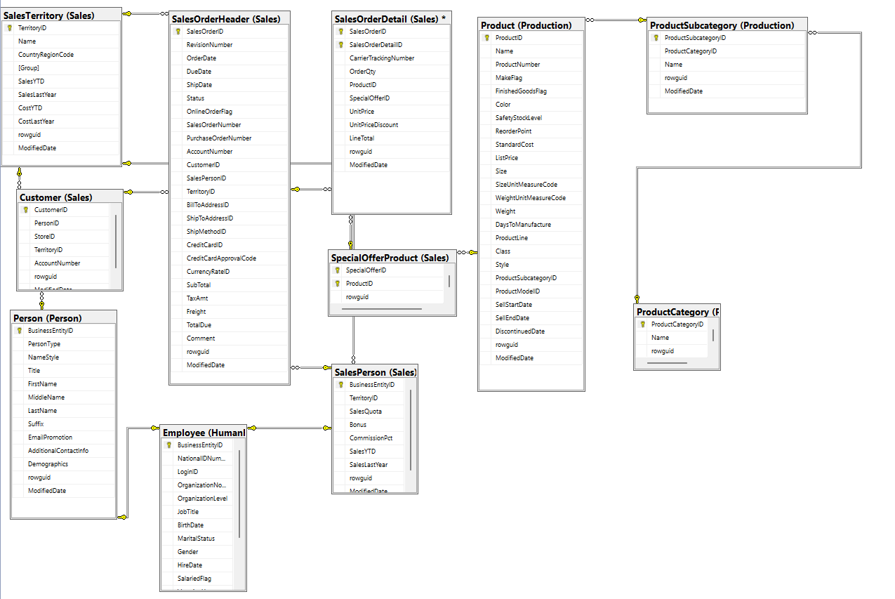
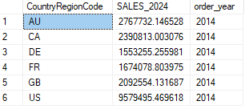
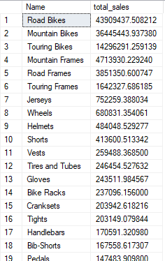
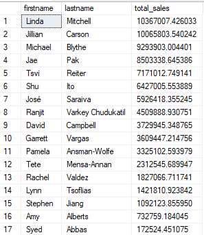
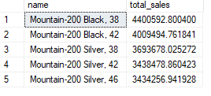
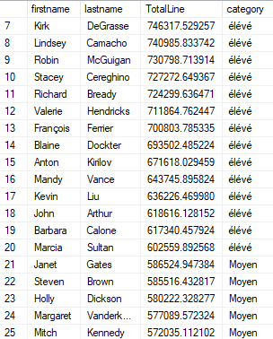
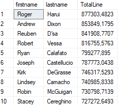
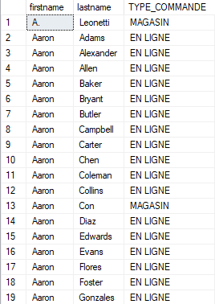
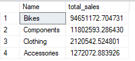
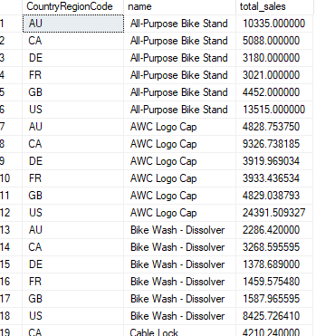

# Adventure Works sales - SQL SERVER

## Source de données
[AdventureWorksSales](https://learn.microsoft.com/en-us/sql/samples/adventureworks-install-configure?view=sql-server-ver17&tabs=ssms)

## Problématique métier
Une entreprise souhaite analyser ses performances en termes deventes, de produits, de régions et de segments de clients. L’objectif estde produire des rapports automatisés et de segmenter les clients etles ventes afin d’optimiser les décisions commerciales.

## Objectif
Utiliser SQL pour :
- Analyser les ventes par produit, région et segment de client.
- Calculer des indicateurs clés de performance (KPI) comme lerevenu moyen par client, le revenu total par agent de vente, etc.
- Créer des vues SQL pour automatiser la génération de rapports deperformance.

## Modèle de données



## I.   Requêtes de base 

### 1. Ventes par région 2014

```sql
    SELECT t.CountryRegionCode, SUM(sd.LineTotal) as SALES_2024, YEAR(so.OrderDate) as order_year
    FROM Sales.SalesTerritory as t
    INNER JOIN Sales.SalesOrderHeader as so
    ON so.TerritoryID = t.TerritoryID
    INNER JOIN Sales.SalesOrderDetail as sd
    ON so.SalesOrderID = sd.SalesOrderID
    WHERE YEAR(so.OrderDate) = 2014
    GROUP BY t.CountryRegionCode,YEAR(so.OrderDate)
```

#### Aperçu



Afficher le total des ventes par région pourl’année 2014   

### 2. Ventes par sous-catégorie de produit

```sql
    SELECT sc.Name, SUM(sd.LineTotal) as total_sales
    FROM Sales.SalesOrderDetail as sd
    INNER JOIN Production.Product as pd
    ON pd.ProductID = sd.ProductID
    INNER JOIN Production.ProductSubcategory as sc
    ON pd.ProductSubcategoryID = sc.ProductSubcategoryID
    GROUP BY sc.Name
    ORDER BY SUM(sd.LineTotal) desc
```
#### Aperçu



les ventes totales pour chaque catégorie de produit.


## II.   Agrégations et relations

### 1. Ventes par agent de vente

```sql
SELECT ps.firstname, ps.lastname,  SUM(sd.LineTotal) as total_sales
FROM Sales.SalesOrderDetail as sd
INNER JOIN Sales.SalesOrderHeader as sh
ON sh.SalesOrderID = sd.SalesOrderID
INNER JOIN Sales.SalesPerson as sp
ON sh.SalesPersonID = sp.BusinessEntityID
INNER JOIN HumanResources.Employee as emp
ON emp.BusinessEntityID = sp.BusinessEntityID
INNER JOIN Person.Person as ps
ON ps.BusinessEntityID = emp.BusinessEntityID
GROUP BY ps.firstname, ps.lastname
ORDER BY SUM(sd.LineTotal) desc
```
#### Aperçu



les ventes totales réalisées par chaque agent de vente.

### 2. Top 5 des produits

```sql
SELECT TOP 5 pd.name , SUM(sd.LineTotal) as total_sales
FROM Sales.SalesOrderDetail as sd
INNER JOIN Production.Product as pd
ON pd.ProductID = sd.ProductID
GROUP BY pd.Name
ORDER BY SUM(sd.LineTotal) desc
```
#### Aperçu



Afficher les 5 produits les plus rentables (entermes de revenus générés).

## III.  Analyse des segments de clients.

### 1. Segmentation des clients par montant dépensé

```sql
SELECT  ps.firstname, ps.lastname, SUM(sd.LineTotal) AS TotalLine,
CASE 
    WHEN SUM(sd.LineTotal) < 300000 THEN 'bas'
    WHEN SUM(sd.LineTotal) >=300000 AND SUM(sd.LineTotal) <600000 THEN 'Moyen'
    WHEN SUM(sd.LineTotal) > 600000 THEN 'élévé'
    ELSE 'autre'
 END AS category
FROM Sales.Customer as c
INNER JOIN Sales.SalesOrderHeader as so
ON so.CustomerID = c.CustomerID
INNER JOIN Sales.SalesOrderDetail as sd
ON so.SalesOrderID = sd.SalesOrderID
INNER JOIN Person.Person as ps
ON c.PersonID = ps.BusinessEntityID
GROUP BY  ps.firstname, ps.lastname
ORDER BY TotalLine DESC
```
#### Aperçu



Créer dessegments de clients basés sur le montant total dépensé (parexemple, bas, moyen, élevé).

### 2. Top 10 des clients

```sql
SELECT TOP 10 ps.firstname, ps.lastname, SUM(so.SubTotal) AS TotalLine
FROM Sales.Customer as c
INNER JOIN Sales.SalesOrderHeader as so
ON so.CustomerID = c.CustomerID
INNER JOIN Person.Person as ps
ON c.PersonID = ps.BusinessEntityID
GROUP BY  ps.firstname, ps.lastname
ORDER BY TotalLine DESC
```
#### Aperçu



Identifier les 10 clients ayant généré le plusde revenus.

### 3. Clients par type de commande

```sql
SELECT ps.firstname, ps.lastname,
CASE 
	WHEN so.OnlineOrderFlag = 1 THEN 'EN LIGNE'
	WHEN so.OnlineOrderFlag = 0 THEN 'MAGASIN'
END as TYPE_COMMANDE
FROM Sales.SalesOrderHeader as so
INNER JOIN Sales.Customer as c
ON c.CustomerID = so.CustomerID
INNER JOIN Person.Person as ps
ON ps.BusinessEntityID = c.PersonID
GROUP BY ps.firstname, ps.lastname,so.OnlineOrderFlag
```
#### Aperçu



Fournir une requête affichant lesclients qui ont acheté des produits en ligne et ceux qui ont fait desachats en magasin.

### 4. Ventes par catégorie de produit

```sql
SELECT c.Name, SUM(sd.LineTotal) as total_sales
FROM Sales.SalesOrderDetail as sd
INNER JOIN Production.Product as pd
ON pd.ProductID = sd.ProductID
INNER JOIN Production.ProductSubcategory as sc
ON pd.ProductSubcategoryID = sc.ProductSubcategoryID
INNER JOIN Production.ProductCategory as c
ON sc.ProductCategoryID = c.ProductCategoryID
GROUP BY c.Name
ORDER BY SUM(sd.LineTotal) desc
```
#### Aperçu


Fournir une requête affichant lesventes par type de produit

### 4. Ventes par catégorie de produit

```sql
SELECT ps.firstname, ps.lastname,
CASE 
	WHEN so.OnlineOrderFlag = 1 THEN 'EN LIGNE'
	WHEN so.OnlineOrderFlag = 0 THEN 'MAGASIN'
END as TYPE_COMMANDE
FROM Sales.SalesOrderHeader as so
INNER JOIN Sales.Customer as c
ON c.CustomerID = so.CustomerID
INNER JOIN Person.Person as ps
ON ps.BusinessEntityID = c.PersonID
GROUP BY ps.firstname, ps.lastname,so.OnlineOrderFlag
```
#### Aperçu



Fournir une requête affichant les clients qui ont acheté des produits en ligne et ceux qui ont fait desachats en magasin.

## IV.  Optimisation des ventes.

### Ventes par région et par produit

```sql
SELECT t.CountryRegionCode, pd.name, SUM(sd.LineTotal) as total_sales
FROM Sales.SalesTerritory as t
INNER JOIN Sales.SalesOrderHeader as so
ON so.TerritoryID = t.TerritoryID
INNER JOIN Sales.SalesOrderDetail as sd
ON so.SalesOrderID = sd.SalesOrderID
INNER JOIN Production.Product as pd
ON pd.ProductID = sd.ProductID
GROUP BY  pd.Name, t.CountryRegionCode
ORDER BY 
  pd.Name, 
  t.CountryRegionCode;
```
#### Aperçu 


Afficher les ventes totales par produit pour chaque région.
