# Chinool music sales - SQL SERVER

## Source de données
[Chinook](Chinook_SqlServer.sql)

## Problématique métier
Une entreprise souhaite produire un rapport détaillant les ventestotales par produit pour le dernier trimestre.

## Objectif
Utiliser SQL pour extraire, filtrer et agréger les données nécessaires.

## Modèle de données


## I.   Requêtes de base 

### 1. Clients non américains

```sql
SELECT CustomerId,
    CONCAT(FirstName,' ',LastName) as full_name,
    Country
FROM Customer
WHERE Country != 'Usa';
```

requête affichant les
Clients (leurs noms complets, ID client et pays) qui ne sont pas aux
États-Unis.    

### 2. Clients brésiliens

```sql
    SELECT CustomerId,
        CONCAT(FirstName,' ',LastName) as full_name,
        Country
    FROM Customer
    WHERE Country = 'Brazil';
```
requête affichant uniquement
les Clients provenant du Brésil.

### 3. Factures des clients brésiliens

```sql
    SELECT i.InvoiceId,
        CONCAT(c.FirstName,' ',c.LastName) as full_name,
        i.InvoiceDate,
        i.Total as amount,
        i.BillingCountry
    FROM Customer c
    INNER JOIN Invoice i
    ON c.CustomerId = i.CustomerId
    WHERE c.Country = 'Brazil';
```
requête affichant
les factures des clients qui sont du Brésil.

### 4. Liste des agents de ventes

```sql
SELECT  CONCAT(FirstName,' ',LastName) as sales_agent
FROM Employee
WHERE Title LIKE '%sales%' 
AND title LIKE '%agent%'
```
####    Aperçu

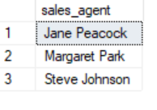

Nous avons 3 agents de ventes

### 5. Pays unique présent dans les factures

```sql
    SELECT DISTINCT(billingcountry)
    FROM Invoice;
```
requête affichant
une liste unique des pays de facturation présents dans la table Invoice.

### 6. Factures par agent de ventes

```sql
    SELECT   CONCAT(e.FirstName,' ',e.LastName) as sales_agent, i.*
    FROM Employee e
    INNER JOIN Customer c
    ON c.SupportRepId = e.EmployeeId
    INNER JOIN Invoice i
    ON i.CustomerId = c.CustomerId
    WHERE e.Title LIKE '%sales%' 
    AND e.title LIKE '%agent%'
    ORDER BY sales_agent
```
Factures associées à chaque agent de vente.

### 7. Détails des factures

```sql
SELECT   CONCAT(e.FirstName,' ',e.LastName) as sales_agent,
CONCAT(c.FirstName,' ',c.LastName) as customer,
i.InvoiceId,
i.BillingCountry,
i.total
FROM Employee e
INNER JOIN Customer c
ON c.SupportRepId = e.EmployeeId
INNER JOIN Invoice i
ON i.CustomerId = c.CustomerId
WHERE e.Title LIKE '%sales%' 
AND e.title LIKE '%agent%'
ORDER BY total DESC
```
Requête affichant le total de
chaque facture, le nom du client, le pays et le nom de l'agent de vente.


## II.   Analyse par année et lignes de facture

### 1. Ventes par année

```sql
SELECT count(*) as total_ventes,
	   sum(total) as montant_total_ventes,
	   YEAR(Invoicedate) as billing_year
	  
from Invoice
GROUP BY   YEAR(Invoicedate) 
```
#### Aperçu

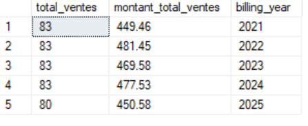

Ici nous avoons les quantités et les montants des ventes pour les années 2021 à 2025

### 2. Nombre d'élément par facture

```sql
SELECT  InvoiceId, SUM(Quantity) as number_of_items
FROM InvoiceLine
GROUP BY InvoiceId
ORDER BY InvoiceId ASC
```
Requête comptant le nombre
d'articles (line items) pour chaque facture.

## III.  Détails des morceaux

### 1. Nom des morceaux

```sql
SELECT t.name,
       i.*
FROM Track t
INNER JOIN InvoiceLine i
ON t.TrackId = i.TrackId
```
Requête incluant le nom du
morceau pour chaque ligne de facture.

### 2. Morceaux et artistes

```sql
SELECT t.name as track_name,
	   a.name as artist_name,
       i.*
FROM Track t
INNER JOIN InvoiceLine i
ON t.TrackId = i.TrackId
INNER JOIN Album al
ON al.AlbumId = t.AlbumId
INNER JOIN Artist a
ON al.ArtistId = a.ArtistId
```
Requête incluant le nom du
morceau acheté et le nom de l'artiste pour chaque ligne de facture.

## IV.  Comptages et regroupements 

### 1. Nombre de factures par pays

```sql
SELECT  BillingCountry,
        COUNT(*) as total_invoice
FROM Invoice
GROUP BY BillingCountry
ORDER BY total_invoice DESC;
```
#### Aperçu 
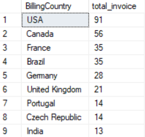

On remarque que la pluspart des factures viennent des USA

### 2. Nombre de morceaux par playlist

```sql
SELECT p.name,
	   COUNT(*) as total_track
FROM Playlist p
INNER JOIN PlaylistTrack pt
ON p.PlaylistId = pt.PlaylistId
INNER JOIN Track t
ON pt.TrackId = t.TrackId
GROUP BY p.name
ORDER BY total_track DESC;
```

#### Aperçu 
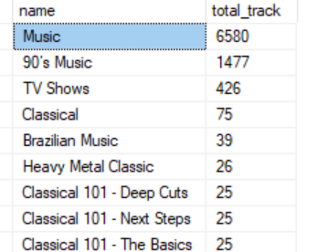

La playlist la plus volumineuse est Music

### 3. Liste des morceaux

```sql
SELECT p.name,
	   COUNT(*) as total_track
FROM Playlist p
INNER JOIN PlaylistTrack pt
ON p.PlaylistId = pt.PlaylistId
INNER JOIN Track t
ON pt.TrackId = t.TrackId
GROUP BY p.name
ORDER BY total_track DESC;
```
requête affichant tous les
morceaux (Tracks), mais sans afficher les IDs.
Le tableau résultant doit inclure le nom de l'album, le type de média
et le genre.

## V. Analyse des ventes

### 1. Factures et articles

```sql
SELECT InvoiceId, SUM(quantity) as total_qty
FROM InvoiceLine
GROUP BY InvoiceId
ORDER BY  InvoiceId
```
Toutes les
factures, avec le nombre d'articles par facture.

### 2. Ventes par agent de vente

```sql
SELECT  e.EmployeeId, CONCAT(e.FirstName,' ',e.LastName) as sales_agent, COUNT(i.InvoiceId) as total_sales
FROM Employee e
INNER JOIN Customer c
ON c.SupportRepId = e.EmployeeId
INNER JOIN Invoice i
ON i.CustomerId = c.CustomerId
WHERE e.Title LIKE '%sales%' 
AND e.title LIKE '%agent%'
GROUP BY e.EmployeeId, CONCAT(e.FirstName,' ',e.LastName)
```
#### Aperçu 
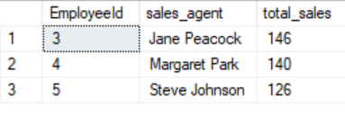

l'agent Jane Peacock totalise le plus grands nombres de ventes

### 3. Meilleur agent 2024

```sql
WITH Rankedsales AS ( 
SELECT  e.EmployeeId,
        CONCAT(e.FirstName,' ',e.LastName) as sales_agent,
		COUNT(i.InvoiceId) as total_sales,
		DENSE_RANK() OVER ( ORDER BY COUNT(i.InvoiceId) DESC) as Rank_sale
FROM Employee e
INNER JOIN Customer c
ON c.SupportRepId = e.EmployeeId
INNER JOIN Invoice i
ON i.CustomerId = c.CustomerId
WHERE e.Title LIKE '%sales%' 
AND e.title LIKE '%agent%'
AND YEAR(i.InvoiceDate) = 2024
GROUP BY e.EmployeeId, CONCAT(e.FirstName,' ',e.LastName))
SELECT EmployeeId, sales_agent, total_sales
FROM RankedSales
WHERE Rank_sale = 1;
```
#### Aperçu 
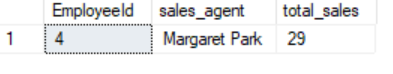

Le meilleur  agent de vente 2024 est Margaret Park

### 4. Meilleur agent 2025

```sql
WITH Rankedsales AS ( 
SELECT  e.EmployeeId,
        CONCAT(e.FirstName,' ',e.LastName) as sales_agent,
		COUNT(i.InvoiceId) as total_sales,
		DENSE_RANK() OVER ( ORDER BY COUNT(i.InvoiceId) DESC) as Rank_sale
FROM Employee e
INNER JOIN Customer c
ON c.SupportRepId = e.EmployeeId
INNER JOIN Invoice i
ON i.CustomerId = c.CustomerId
WHERE e.Title LIKE '%sales%' 
AND e.title LIKE '%agent%'
AND YEAR(i.InvoiceDate) = 2025
GROUP BY e.EmployeeId, CONCAT(e.FirstName,' ',e.LastName))
SELECT EmployeeId, sales_agent, total_sales
FROM RankedSales
WHERE Rank_sale = 1;
```
#### Aperçu 
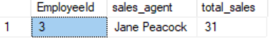

Le meilleur  agent de vente 2025 est Jane Peacock

## VI. Analyse des clients et des pays

### 1. Clients par agent de vente

```sql
SELECT   CONCAT(e.FirstName,' ',e.LastName) as sales_agent, COUNT(c.SupportRepId) as total_customers
FROM Employee e
INNER JOIN Customer c
ON c.SupportRepId = e.EmployeeId
WHERE e.Title LIKE '%sales%' 
AND e.title LIKE '%agent%'
GROUP BY  CONCAT(e.FirstName,' ',e.LastName);
```
#### Aperçu 
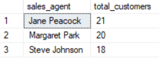

Jane Peacock possède le plus grand nombre de client

### 2. Ventes totales par pays 

```sql
SELECT  BillingCountry,
        SUM(total) as total_sales
FROM Invoice
GROUP BY BillingCountry
ORDER BY total_sales DESC;
```
#### Aperçu 
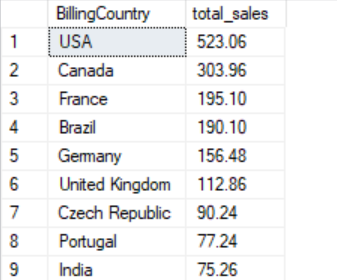

Le pays avec le plus de ventes est USA

## VII. Analyse des morceaux et des artistes

### 1. Morceau le plus acheté en 2023

```sql
WITH track_ranking AS( SELECT t.name,
	   SUM(il.quantity) AS QTE,
	   RANK() OVER (ORDER BY SUM(il.quantity) DESC) as position
FROM track t
INNER JOIN InvoiceLine il
ON il.TrackId = t.TrackId
INNER JOIN Invoice i
ON i.InvoiceId = il.InvoiceId
WHERE YEAR(i.InvoiceDate) = 2023
GROUP BY t.name)
SELECT name, QTE
FROM track_ranking
WHERE position = 1;
```
#### Aperçu 
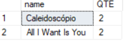

Les morceaux les plus écoutés en 2023 sont "Caleidoscopio" et "All i want is you"

### 2. Top 5 des morceaux les plus achetés

```sql
WITH track_ranking AS( SELECT t.name,
	   SUM(il.quantity) AS QTE,
	   ROW_NUMBER() OVER (ORDER BY SUM(il.quantity) DESC) as position
FROM track t
INNER JOIN InvoiceLine il
ON il.TrackId = t.TrackId
INNER JOIN Invoice i
ON i.InvoiceId = il.InvoiceId
GROUP BY t.name)
SELECT name, QTE
FROM track_ranking
WHERE position <= 5 ;
```
#### Aperçu 
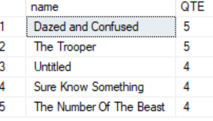

### 3. Top 3 des artistes les plus vendus

```sql
WITH artist_ranking AS( SELECT 
	   a.name as artist_name,
	   SUM(il.quantity) AS QTE,
	   ROW_NUMBER() OVER (ORDER BY SUM(il.quantity) DESC) as position
FROM track t
INNER JOIN InvoiceLine il
ON il.TrackId = t.TrackId
INNER JOIN Invoice i
ON i.InvoiceId = il.InvoiceId
INNER JOIN Album al
ON al.AlbumId = t.AlbumId
INNER JOIN Artist a
ON al.ArtistId = a.ArtistId
GROUP BY a.name)
SELECT artist_name, QTE
FROM artist_ranking
WHERE position <= 3 ;

```
#### Aperçu 
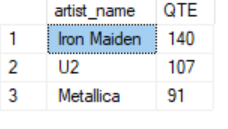

### 4. Type de média le plus acheté

```sql
WITH media_type_ranking AS( SELECT 
	   m.name as media_type,
	   SUM(il.quantity) AS QTE,
	   RANK() OVER (ORDER BY SUM(il.quantity) DESC) as position
FROM track t
INNER JOIN InvoiceLine il
ON il.TrackId = t.TrackId
INNER JOIN Invoice i
ON i.InvoiceId = il.InvoiceId
INNER JOIN MediaType m
ON m.MediaTypeId = t.MediaTypeId
GROUP BY m.name)
SELECT media_type, QTE
FROM media_type_ranking
WHERE position = 1 ;
WHERE position <= 3 ;

```
#### Aperçu 
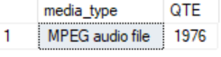


## Chinooc music sales
[Télécharger le projet](Automatisation_des_rapports_de_ventes.sql)