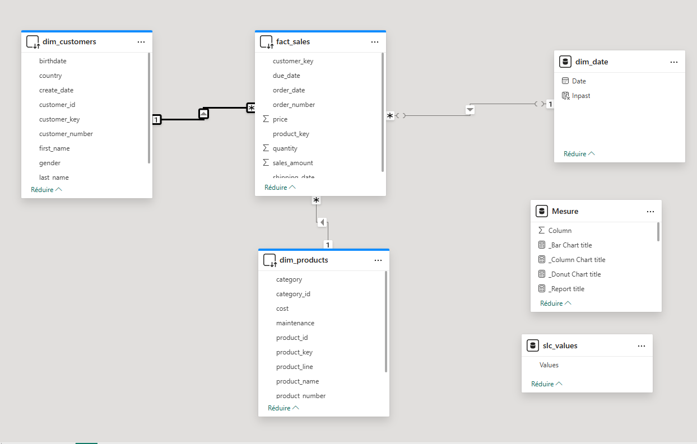
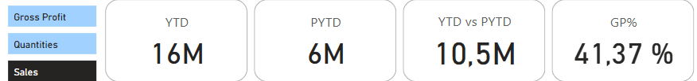
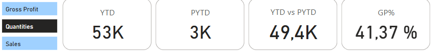
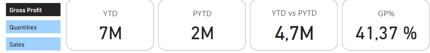
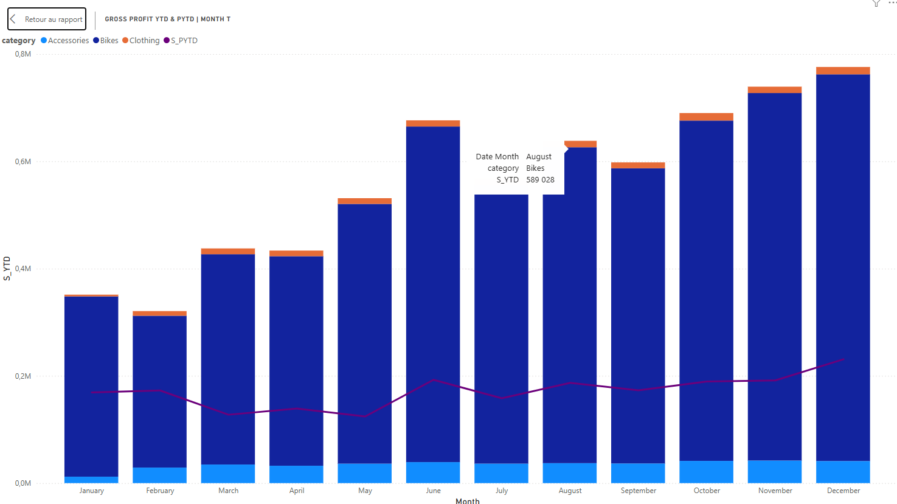

# Data warehouse consumption - Power BI

## Prérequis
Avoir mis en place un DataWarehouse comme dans le projet [sql datawarehouse](/sql-data-warehouse-project/)


## Objectif
Le Data warehouse est déjà en place il s'agit ici de consommer le datamart(couche gold) pour ressortir des éléments critiques dans la prise de décision .

---
## I.  Netoyage des données 


### 1. Transformation des données
- Ajout d'une table Dim_Date qui nous servira de calendrier: 
  ```dax
   dim_date = CALENDAR( DATE(2010, 1, 1), DATE(2014, 12,31))
    ```
  nos données de ventes vont de l'année 2010 à 2014 donc notre calendrier ira du 01/01/2010 au 31/12/2014 

- Ajout de la colonne Inpast dans la table Dim_Date
  ```dax
    Inpast = VAR lastsalesdate = Max(Fact_Sale[Date_Time]) VAR lastsalesdatePY = EDATE(lastsalesdate, -12) RETURN Dim_Date[Date] <= lastsalesdatePY
    ```
     nous récupérons toutes les dates de ventes dans la variables lastsalesdate, ensuite dans la variable lastsalesdatePY nous mettons chaque date de la variable lastsalesdate mais avec 12 mois de Moins, enfin nous vérifions si les dates de lastsalesdate sont disponible dans notre calendrier

     cette variable nous permetra de comparer les performances d'un mois avec celles du même mois de l'année antérieur
- Création de la table slc_values avec la colonne Values( Sales Gross Profit Quantity)

 ### 3. Mesures

- Total des ventes
 ```dax
    Sales = Sum(fact_sales[sales_amount])
 ```
 somme des montants de ventes
- Quantités Vendues
 ```dax
  Quantity = Sum(fact_sales[quantity])
 ``` 
  somme des quantités vendues
- Prix de revient
 ```dax
    COGS = SUMX(fact_sales,
    fact_sales[quantity] * RELATED(dim_products[cost]))
 ``` 

- Profit Brut
 ```dax
    Gross Profit = [Sales] - [COGs]
 ``` 
 le profit brut représente la différence entre le montant des ventes et le montant des dépences
 - Marge Bénéficiaire
 ```dax
    GP% = DIVIDE([Gross Profit],[Sales])
 ``` 
 Montre la rentabilité de l'entreprise
 - Chiffre d'Affaires Cumulé
 ```dax
   YTD_Sales = TOTALYTD([Sales], Fact_Sale[Date_Time])
 ``` 
 Cette mesure calcule le chiffre d'affaires cumulé depuis le début de l'année jusqu'à la date actuelle

 - Chiffre d'Affaires Cumulé de l'an passé à la même période
 ```dax
   PYTD_Sales = 
CALCULATE(
    [Sales], 
    SAMEPERIODLASTYEAR(Dim_Date[Date]), 
    Dim_Date[Inpast] = TRUE
)

 ``` 
cette mesure vérifie si la période actuelle - 12 mois existe dans notre calendrier grace à  Dim_Date[Inpast] = TRUE et calcule le chiffre d'affaires cumulé à cette période 
 
  - Quantité Cumulé
 ```dax
   YTD_Quantities = TOTALYTD([Quantity],Fact_Sale[Date_Time])
 ``` 
 Cette mesure calcule la quantité vendue cumulé depuis le début de l'année jusqu'à la date actuelle

  - Quantité Cumulé de l'an passé à la même période
 ```dax
   PYTD_Quantities = 
CALCULATE(
    [Quantity], 
    SAMEPERIODLASTYEAR(Dim_Date[Date]), 
    Dim_Date[Inpast] = TRUE
)
 ``` 
cette mesure vérifie si la période actuelle - 12 mois existe dans notre calendrier grace à  Dim_Date[Inpast] = TRUE et calcule la quantité vendu cumulé à cette période 

  - Profit Brut Cumulé

 ```dax
   YTD_GrossProfit = TOTALYTD([Gross Profit],Fact_Sale[Date_Time])
 ``` 
Elle calcule le profit brut cumulé (Gross Profit Year-To-Date) en additionnant toutes les valeurs de [Gross Profit] depuis le 1er janvier jusqu'à la date en cours 

 - Profit Brut Cumulé de l'an passé à la même période

 ```dax
   PYTD_Gross_Profit = 
CALCULATE(
    [Gross Profit], 
    SAMEPERIODLASTYEAR(Dim_Date[Date]), 
    Dim_Date[Inpast] = TRUE
)
 ``` 
cette mesure vérifie si la période actuelle - 12 mois existe dans notre calendrier grace à  Dim_Date[Inpast] = TRUE et calcule le profit brut cumulé à cette période 
 
 - Mesure dynamique des indicateurs YTD
  ```dax
S_YTD = 
VAR selected_value = SELECTEDVALUE(Slc_values[Values])
VAR result = SWITCH(selected_value,
"Sales", [YTD_Sales],
"Quantity", [YTD_Quantities],
"Gross Profit", [YTD_GrossProfit],
BLANK()
)
RETURN
result
 ``` 
Cette mesure S_YTD permet de retourner dynamiquement l'un des trois indicateurs YTD (Year-To-Date) en fonction de la sélection faite dans Slc_values[Values]. Elle utilise SWITCH pour afficher soit les ventes (YTD_Sales), les quantités (YTD_Quantities) ou le profit brut (YTD_GrossProfit). Si aucune valeur valide n'est sélectionnée, elle retourne BLANK().

 - Mesure dynamique des indicateurs PYTD
  ```dax
S_PYTD = 
VAR selected_value = SELECTEDVALUE(Slc_values[Values])
VAR result = SWITCH(selected_value,
"Sales", [PYTD_Sales],
"Quantity", [PYTD_Quantities],
"Gross Profit", [PYTD_Gross_Profit],
BLANK()
)
RETURN
result
 ``` 
Cette mesure S_PYTD permet de retourner dynamiquement l'un des trois indicateurs PYTD (Year-To-Date) en fonction de la sélection faite dans Slc_values[Values]. Elle utilise SWITCH pour afficher soit les ventes (PYTD_Sales), les quantités (PYTD_Quantities) ou le profit brut (PYTD_GrossProfit). Si aucune valeur valide n'est sélectionnée, elle retourne BLANK().

 - Comparaison des indicateurs
  ```DAX 
  YTD vs PYTD = [S_YTD] - [S_PYTD]
  ```
  Ici nous comparons la valeur d'un incateur à sa valeur 1 an

### 2. Aperçu des données
Les données sont importées en direct query de la base de données SQL SERVER 


### 4. Model de données



Nous avons un  modèle en étoile avec pour table de faits "Fact_Sale" et tables de dimensions "Dim_product", "Dim_Date", "Dim_Customers"

"_mesure" et "Slc_values" servent juste pour les calculs et les filtres 

 ## II. Graphiques 

 ### 1. Montants des ventes 2013



- YTD = montant cumulé des ventes de l'an 2013
- PYTD = montant cumulé des ventes de l'an 2012
- YTD vs PYTD = la variation du montant des ventes entre les années 2013 et 2012(hausse de 10,5M)
- GP% = marge bénéficiaire de l'année 2013

 ### 2. Quantité Vendue 2013



- YTD = quantité cumulé des ventes de l'an 2013
- PYTD = quantité cumulé des ventes de l'an 2012
- YTD vs PYTD = la variation des quantités vendues entre les années 2023 et 2022(hausse de 49,4K)
- GP% = marge bénéficiaire de l'année 2013

### 3. Profit Brut 2023



- YTD = profit brut de l'an 2013
- PYTD = profit brut de l'an 2012
- YTD vs PYTD = la variation des profit brut entre les années 2023 et 2022(hausse de 4,7M)
- GP% = marge bénéficiaire de l'année 2013

### 4.  Profit par sous-catégorie


En 2013 le produit le plus bénéfique est le vélo de montagne

### 5.  variation du profit brut entre les mois de l'année 2013 et 2012


Les profits des mois de l'année 2013 sont tous plus intérésents que ceux de l'année 2012.
L'année 2013 a dominé sur tout les mois 


### 6.  Evolution du profit brut au cours  des mois des années 2013 et 2012



Nous avons la superpositions de 2 graphes:
- histogramme empilé qui montre l'évolution du profit aux cours de l'année 2013
- graphique en courbe qui montre l'évolution du profit aux cours de l'année 2012

### 7.  Profit en fonction de la gamme de produit


La meilleur gamme de produit est celle des montagnes

### NB

pour notre petite analyse nous avons fixé le filtre sur  l'année 2013 et sur l'indice de profit brut. Il est possible d évaluer les années 2010 et 2014 ainsi que les montants de ventes et les quantitées vendues 


 ## III. Apperçu du tableau de bord 

 

## Plant Co Performance
[Télécharger le fichier](/DatawareHouse%20Consumption/DatawareHouse%20Consummer.pbix)

## Difficulté

Les tables sont importées en direct query donc les visuels ne charge pas très rapidement

## Piste d'Amélioration

importer juste la table de fait en direct query et les tables de dimensions normalement

