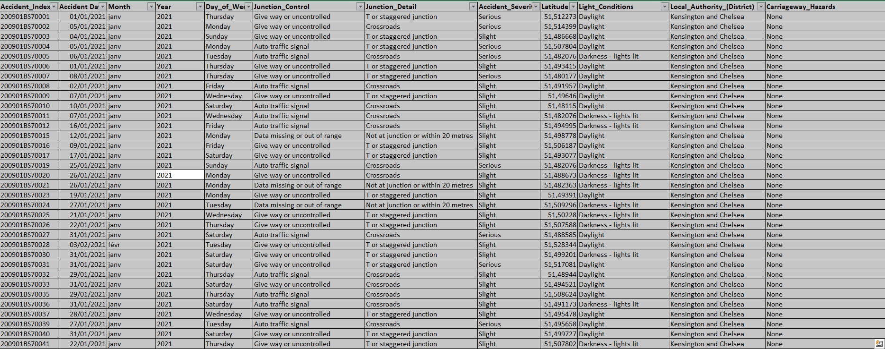
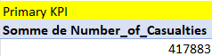
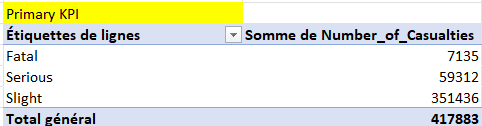
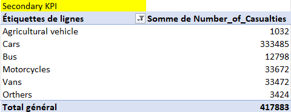
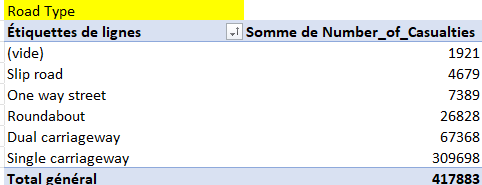
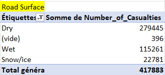
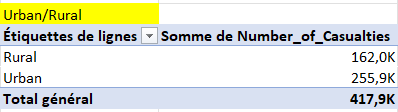
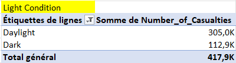
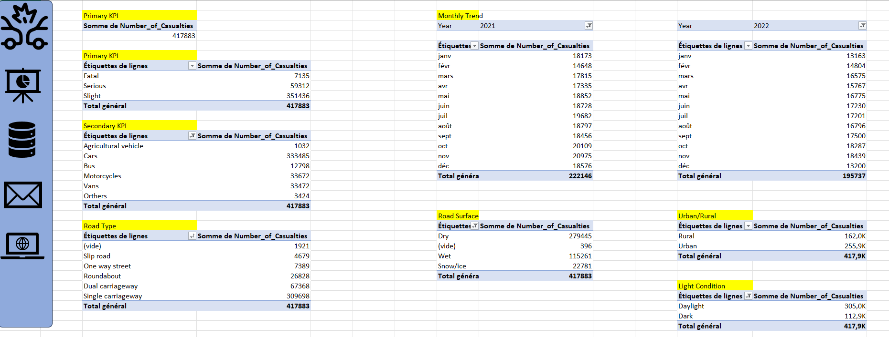
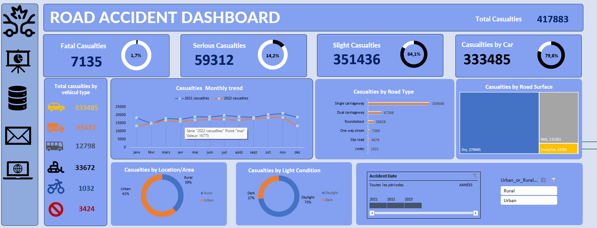

# Road Accident - Excel

## Dataset Source
[Road Accident](https://docs.google.com/spreadsheets/d/1R_uaoZL18nRbqC_MULVne90h3SdRbAyn/edit?rtpof=true&sd=true&pli=1&gid=1319047066#gid=1319047066)

## Objectif
Nous analysons les accidents de la route pour identifier les facteurs influençant leur occurrence, tels que les conditions météorologiques, l'état des infrastructures et les caractéristiques des véhicules.

---
## I.  Netoyage des données 

### 1. Suppression des Doublons
Supprimmer les enregistrements doubles
### 2. Transformation des données
 - Remplacer l' élément Fetal de la colonne Accident Severity par Fatal
 - Ajouter les colone month(mois) et year(année) en se basant sur la colonne accident date

 ### 3. Apperçu du Jeu de données néttoyé

 
 ## II. Tableaux croisés dynamiques 
 ### 1. Total des victimes

 

Nous avons dénombrés 417883 victimes

 ### 2. Analyse des Accidents en Fonction des Sévérités

 

   Nous constatons la sévérité légère est majoritaire ensuite on a sérieuse et enfin fatal

 ### 3. Analyse des Accidents en Fonction du type de véhicule

 

  Pour réaliser ce tableau il a fallu créer des éléments calculés :

  Motorcycles = motorcycle 125cc and under + motorcycle 50cc and under + motorcycle over 125cc and up to 500cc + motorcycle 500cc

  Vans = Van + good 7,5 tones mgw and over +  good over 3,5t and under 7,5t + van/goods 3,5 tones  mgw or under

  Cars = car + taxi/private hire car

  Bus  = minibus + bus or coach

  others = other + pedal cycle

- Les voitures sont de loin les plus impliquées dans les accidents avec victimes (~80%). Cela peut être dû à leur forte présence sur la route.
- Les motos et les vans ont des nombres similaires, ce qui peut suggérer que les deux types de véhicules présentent un risque comparable en termes de victimes.
- Les bus ont un nombre relativement bas de victimes, ce qui pourrait indiquer soit une conduite plus sécurisée, soit un nombre inférieur d’accidents.
- Les véhicules agricoles et "Others" ont un impact marginal.

 ### 4. Analyse des Accidents en Fonction du type de route

 

- Single carriageway (route à une chaussée) : 309 698 victimes (74,1% du total).
- Dual carriageway (route à deux chaussées séparées) : 67 368 victimes (16,1%).
- Roundabout (rond-point) : 26 828 victimes (6,4%).
- One way street (rue à sens unique) : 7 389 victimes (1,8%).
- Slip road (bretelle d'accès) : 4 679 victimes (1,1%).
- (vide) (catégorie non renseignée) : 1 921 victimes (0,5%).

 ### 5. Analyse des Accidents en Fonction de la surface de la route

 

- Dry (route sèche) : 279445 victimes (66,87% du total).
- Wet (route mouillé) : 115261 victimes (25,58% du total).
- (vide) (catégorie non renseignée) : 396 victimes (0,09%).
- Snow/ice (route neigeuse) : 22781 victimes (5,45% du total).

 ### 6. Analyse des Accidents en Fonction du type de region

 

- Rural : 162,0k victimes (38,77% du total).
- Urban : 255,9K victimes (61,23% du total).

 ### 7. Analyse des Accidents en Fonction de la luminosité

 

- lumière du jour : 305,0k victimes (73,15% du total).
- Sombre  : 112,9K victimes (26,85% du total).

 ### 8. Ensemble des TCD 
 

 ## III. Tableau de bord 

 - Tableau de bord

 

 ce tableau de bord nous montre des graphiques qui confirment nos analyses sur les tableaux croisés dynamiques et nous offre des option de filtre sur la date et le type de zone

## IV. Indices de Performances 

 victimes mortelles = 7135 soit 1,7%

 victimes graves = 59312 soit 14,3%

 victimes légères = 351436 soit 84,1 %

 victimes en voitures = 333485 soit 79,8%

## Road Accident
[Télécharger le fichier](Road_Accident_Data_Portfolio.xlsx)