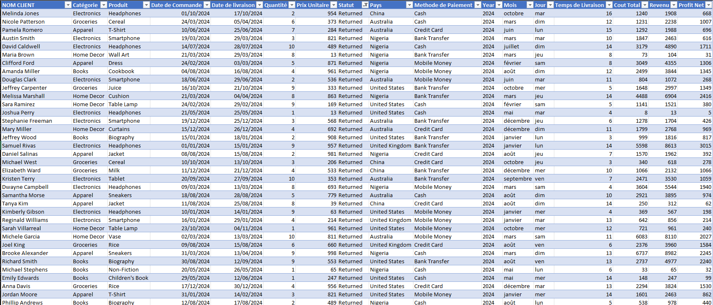
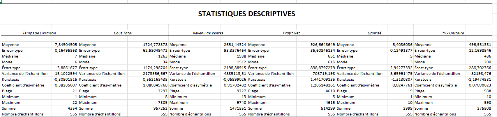
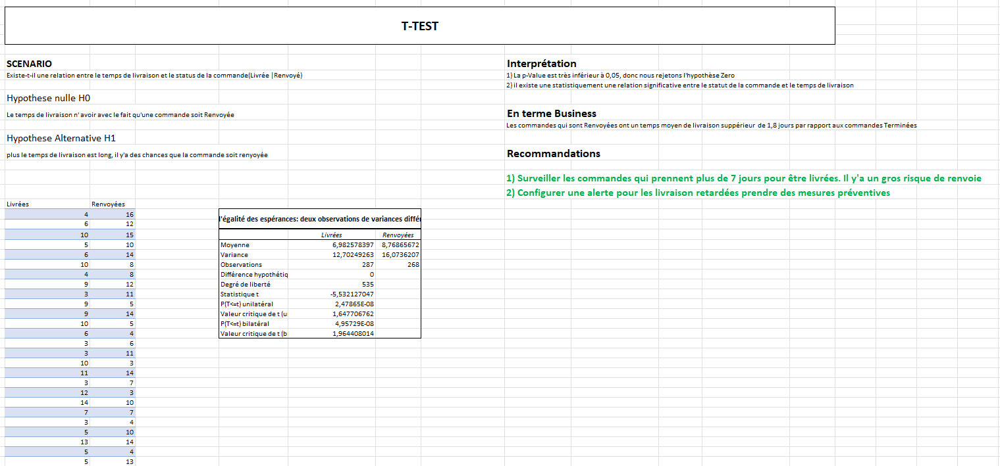
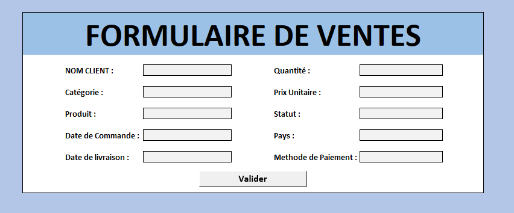
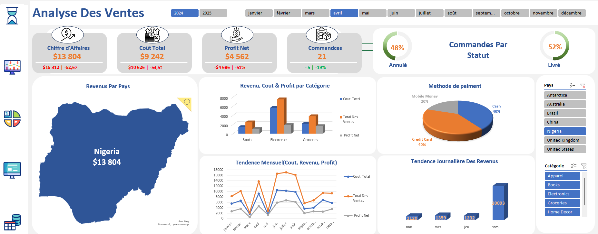

# Sales Scope - Excel

## Dataset Source
[ventes](/Automatisation/Raw%20data/sales_data.xlsx)

## Objectif
Faciliter la gestion, l'analyse et la visualisation des ventes afin d'optimiser la prise de décision commerciale.

---
## I.  Netoyage des données 

### 1. Suppression des Doublons
Supprimmer les enregistrements doubles
### 2. Transformation des données
 - Ajouter les colonnes jour mois années pour la date de commende
 - Ajouter des colonnes calculées: Temps de Livraison, cout Total, Revenu, Profit Net

 

 ### 3. Apperçu du Jeu de données néttoyé

 
 ## II. Statistiques descriptives
 

Ici nous avons un résumé statistique de toutes les colonnes quantitatives

 ## III. Test t de Student
  Notre préoccupation première était de savoir si le statut de la commande(Livrée, Renvoyée) dépendait du temps de livraison. nous avons donc réaliser le test suivant

  

 ## IV. Formulaire de données

 Nous avons configurer à l'aide d'une macro un formulaire d'insertion des données

 

 ## IV. Tableau de bord

 

- Indicateurs de performance (KPI) : en haut, les principaux résultats (chiffre d'affaires, coût total, profit net, nombre de commandes) sont affichés avec l'évolution par rapport à la période précédente.

- Analyse par statut de commande : un graphique circulaire montre la proportion des commandes livrées et annulées.

- Répartition géographique : une carte met en avant les revenus générés par pays, avec un focus automatique sur le pays sélectionné.

- Analyse par catégorie de produits : un graphique en barres présente le coût, le revenu et le profit net pour chaque catégorie de produits.

- Tendances temporelles :

    Mensuelle : l'évolution du coût, du chiffre d'affaires et du profit est visualisée mois par mois.

    Journalière : un graphique en barres illustre les revenus par jour.

- Modes de paiement : un diagramme circulaire présente la répartition des paiements entre différentes méthodes (ex : espèces, carte bancaire, mobile money).

- Filtres interactifs : l'utilisateur peut ajuster l'affichage en fonction de plusieurs filtres, comme :

    L’année (2024 ou 2025)

    Le mois

    Le pays

    La catégorie de produit

 ## Sales Scope
 [Télécharger le fichier](/Automatisation/Final/sales_data.xlsx)