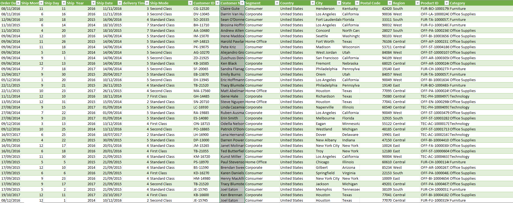
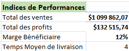
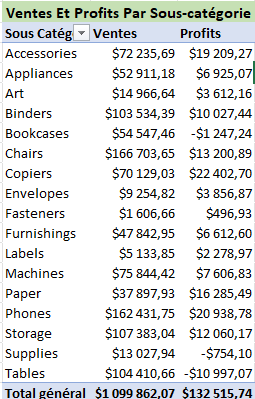
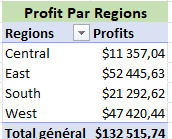
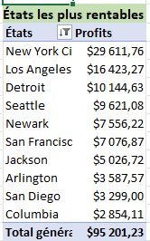

# Superstore sales - Excel

## Source de données
[Superstore](https://www.kaggle.com/datasets/vivek468/superstore-dataset-final)

## Problématique métier
Une entreprise souhaite suivre les performances des ventes par régionet catégorie pour identifier les zones à améliorer.

## Objectif
Créer un tableau de bord interactif pour analyser les KPI clés tels queles ventes, les marges, et les performances régionales.

---
## I.  Netoyage des données 

### 1. Suppression des Doublons
Supprimmer les enregistrements doubles
### 2. Transformation des données
 - tranformer les formats de dates USA en UK
 - Creer les colonnes ship day, ship month, ship year, order day, order month, order year et delivery Time 
 - Convertir les colonnes Sales, Discount et Profit en format monétaire 

### 3. Apperçu du Jeu de données néttoyé

 ## II. Tableaux croisés dynamiques 
 ### 1. Indices de performances

 

 Ici nous avons le total des ventes, les profits, la marge bénéficiaire et le temps moyen de livraison

 ### 2. Ventes et Profits pas sous-catégorie

 

 Le tableau nous montre la répartition des ventes et des profits en fonction des sous-catégories 
 ### 3. Profits par Région

 

  Ici nous avons la répartition des profits par région

 ### 4. Mode de livraison

 

   Ici nous avons le classement par ordre croissant des modes de  livraisons les plus utilisés

### 5. Profits par Mois

 

  ce tableau répartit les profits sur chaque mois de l'année

### 6. Profits par Type de clientelle

 

  Profit en fonction du type de clientelle 
  
### 7. Top 10 des Etats les plus rentables

 
 
 

 ## III. Tableau de bord 

 - Tableau de bord

 

 ce tableau de bord nous montre des graphiques qui confirment nos analyses sur les tableaux croisés dynamiques et nous offre des option de filtre sur les années et les catégories.
 