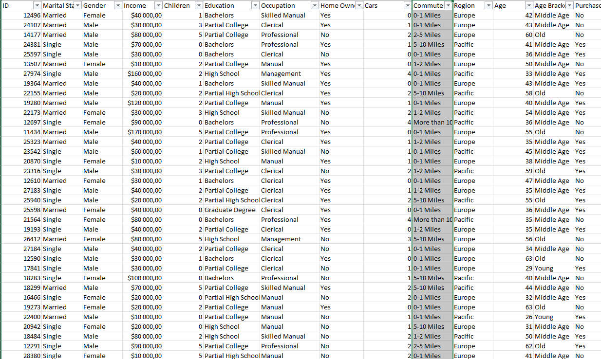
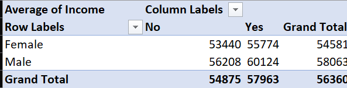
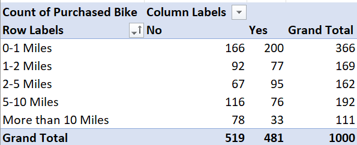
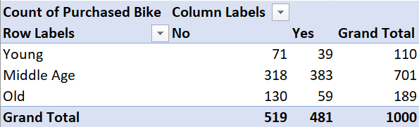
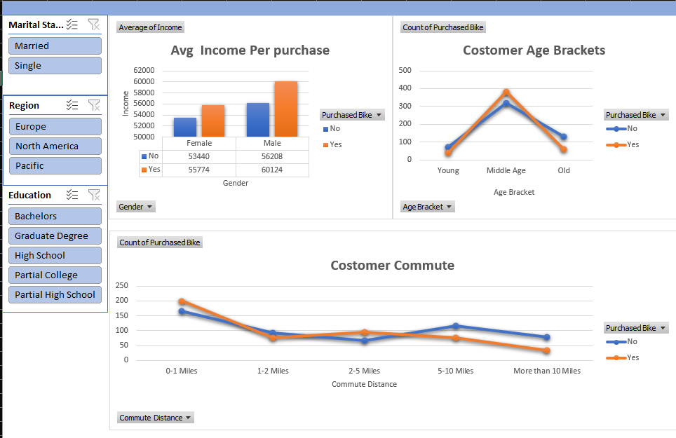

# Bike Buyers - Excel

## Dataset Source
[Bike Buyers](Excel_Project_Dataset.xlsx)

## Objectif
Ce projet vise à identifier et à analyser les facteurs clés qui influencent la décision d'achat des prospects d'un concessionaire de vélos.

---
## I.  Netoyage des données 

### 1. Suppression des Doublons
Supprimmer les enregistrements doubles
### 2. Transformation des données
 - Remplacer les éléments M et F de la colonne Gender respectivement en Male et Female
 - Remplacer les éléments 10+ de la colonne Commute en More than 10
 - Ajout de la colonne Age Bracket pour catégoriser les clients en fonction de leur Age 'Young' pour les clients de moins de 31 ans, 'Middle Age' pour les clients de plus de 31 ans et de moins de 51 ans et enfin 'Old' pour les plus de 51 ans
 ### 3. Apperçu du Jeu de données néttoyé

 ## II. Tableaux croisés dynamiques 
 ### 1. Analyse des Revenus Moyens en Fonction des Décisions d'Achat

 

 Le tableau met en évidence des disparités de revenus basées sur le sexe et les décisions d'achat. Les revenus moyens sont plus élevés pour les hommes que pour les femmes, que ce soit pour ceux qui ont une décision d'achat positive ou négative. En moyenne, les revenus sont également plus élevés pour ceux qui ont une décision positive. 

 ### 2. Analyse des Achats en Fonction des Distances Parcourues

 

  Le tableau montre les résultats des décisions d'achat(positives ou négatives) en fonction des distances parcourues. Les résultats indiquent que les distances comprises entre 0-1 miles et 2-5 miles ont les taux d'achat les plus élevés.

 ### 3. Analyse des Achats de Vélos par Groupe d'Âge

 

   Le tableau ci-dessous montre les résultats des décisions d'achat(positives ou négatives) de vélos en fonction des groupes d'âge (Jeune, Âge moyen, Âgé).Les résultats indiquent que les personnes d'âge moyen ont les taux d'achat les plus élevés, suivies par les les personnes âgées et sles jeunes.

 ## III. Tableau de bord 

 - Tableau de bord

 

 ce tableau de bord nous montre des graphiques qui confirment nos analyses sur les tableaux croisés dynamiques et nous offre des option de filtre sur le statut marital, la région et l'éducation des clients