# Data Professional Survey - Power BI

## Source de données
[Data Survey](data_survey.xlsx)

## Objectif
Analyse des métiers de la data à travers une enquête approfondie, comprenant des questions ciblées pour mieux comprendre leurs spécificités, les compétences requises et les opportunités professionnelles associées. 

---
## I.  Netoyage des données 

### 1. Suppression des Doublons
Supprimmer les enregistrements doubles
### 2. Transformation des données
 - Suppression des colonnes Browser, Os, City, Country et Referrer
 - Remplacez dans les réponses à la question Q1 (Quel titre correspond le mieux à votre rôle actuel ?) tous les rôles qui ne figurent pas parmi les options proposées par "Autres".
 - Remplacez dans les réponses à la question Q5 (Avec quel langage travaillez vous ?) tous les langages qui ne figurent pas parmi les options proposées par "Autres".
  - Remplacez dans les réponses à la question Q11 (Dans quel pays vivez vous?) tous les pays qui ne figurent pas parmi les options proposées par "Autres".
 - la question Q3(quelle est votre salaire annuel) propose des réponses sous forme d'intervalles [Min, Max]. Nous allons remplacer par (Max + Min)/2

 ### 3. Apperçu du Jeu de données néttoyé

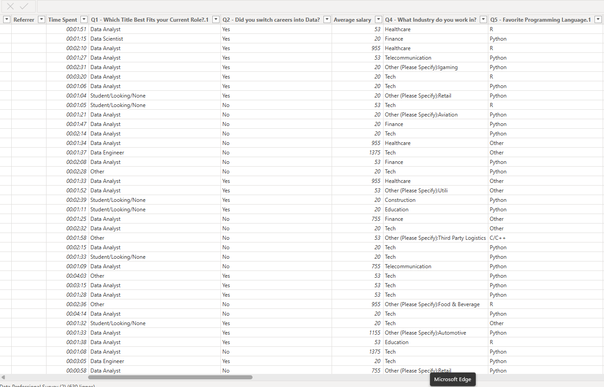 
### 4. Model de données

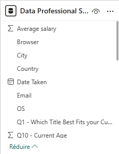

 ## II. Graphiques 

 ### 1. Nombres de participants à l'enquête
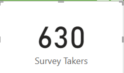

 ### 2. Moyenne d'age 
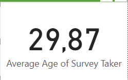

 ### 3. Pays des participants
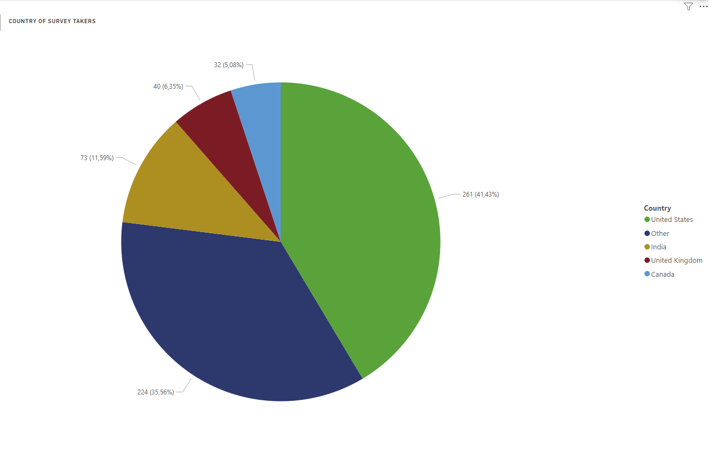

- 41,43% des participants viennent des USA
- 35,56% des participants viennent des Pays non répertoriés
- 11,59% des participants viennent de l'inde
- 6,35% des participants viennent des Royaume-Uni
- 5,08% des participants viennent du Canada

 ### 4. Moyenne des salaires par rôle
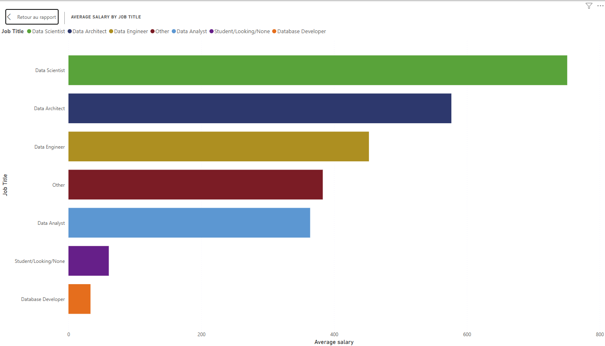

le Top 3 des métiers les mieux payés: Data Scientist, Data Architect, Data Engineer.

 ### 5. Langages les plus utilisés
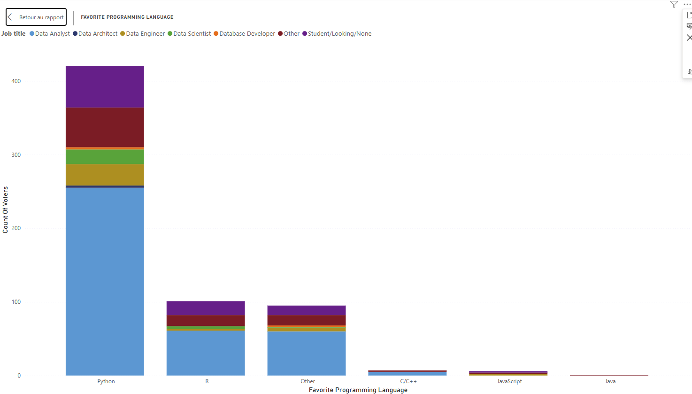

Le language le plus utilisés est python et une grande partie des utilisateurs sont des analystes de données

 ### 6 Difficulté pour entrer dans le monde de la data. 
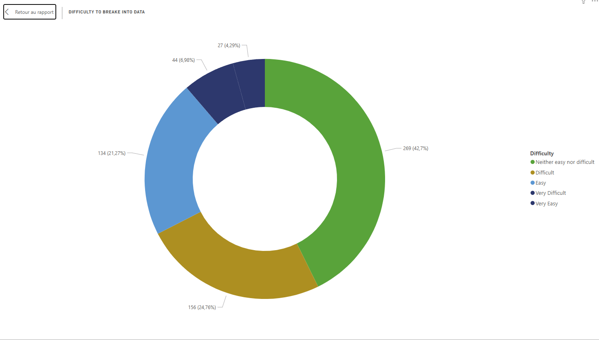

- 42,7% des participants  trouvent le domaine de la data ni facile ni difficile
- 24,76% des participants trouvent ce domaine difficile
- 21,27% des participants trouvent ce domaine facile
- 6,98% des participants trouvent ce domaine très difficile
- 4,29% des participants trouvent ce domaine très facile

 ### 7. Satisfaction Salariale
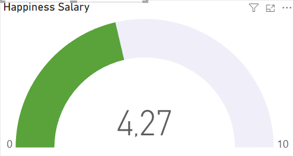

Il s'agit de la valeur actuelle de satisfaction salariale sur une échelle de 0 à 10 et 4,27 représente la valeure centrale.

 ### 8. Satisfaction Dans Le Travail
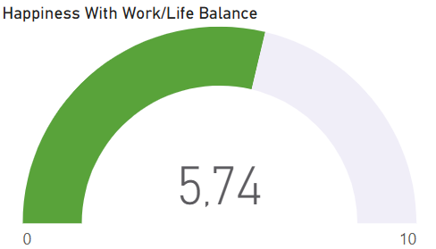

Il s'agit de la valeur actuelle de satisfaction dans le travail sur une échelle de 0 à 10 et 5,74 représente la valeure centrale.

 ## III. Rapport Final

 - Tableau de bord

 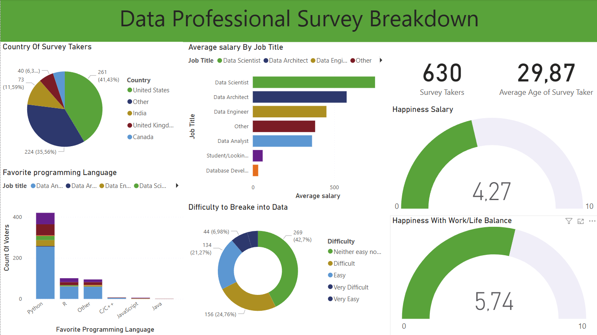