# PLANT.CO SALES - Power BI

## Source de données
[Sales](Plant_DTS.xls)


## Objectif
Ce projet vise à analyser les performances de ventes de la société Plant.Co . Grâce aux données visuelles, nous identifions les variations de ventes par pays, par mois et par type de produit.

---
## I.  Netoyage des données 

### 1. Suppression des Doublons
Supprimmer les enregistrements doubles
### 2. Transformation des données
- Ajout d'une table Dim_Date qui nous servira de calendrier: 
  ```dax
    Dim_Date = CALENDAR( DATE(2022, 1, 1), DATE(2024, 12,31))
    ```
  nos données de ventes vont de l'année 2022 à 2024 donc notre calendrier ira du 01/01/2022 au 31/12/2024 

- Ajout de la colonne Inpast dans la table Dim_Date
  ```dax
    Inpast = VAR lastsalesdate = Max(Fact_Sale[Date_Time]) VAR lastsalesdatePY = EDATE(lastsalesdate, -12) RETURN Dim_Date[Date] <= lastsalesdatePY
    ```
     nous récupérons toutes les dates de ventes dans la variables lastsalesdate, ensuite dans la variable lastsalesdatePY nous mettons chaque date de la variable lastsalesdate mais avec 12 mois de Moins, enfin nous vérifions si les dates de lastsalesdate sont disponible dans notre calendrier

     cette variable nous permetra de comparer les performances d'un mois avec celles du même mois de l'année antérieur
- Création de la table slc_values avec la colonne Values( Sales Gross Profit Quantity)

 ### 3. Mesures

- Total des ventes
 ```dax
    Sales = Sum(Fact_Sale[Sales_USD])
 ```
 somme des montants de ventes
- Quantités Vendues
 ```dax
    Quantity = Sum(Fact_Sale[quantity])
 ``` 
 somme des quantités vendues
- Profit Brut
 ```dax
    Gross Profit = [Sales] - [COGs]
 ``` 
 le profit brut représente la différence entre le montant des ventes et le montant des dépences
 - Marge Bénéficiaire
 ```dax
    GP% = DIVIDE([Gross Profit],[Sales])
 ``` 
 Montre la rentabilité de l'entreprise
 - Chiffre d'Affaires Cumulé
 ```dax
   YTD_Sales = TOTALYTD([Sales], Fact_Sale[Date_Time])
 ``` 
 Cette mesure calcule le chiffre d'affaires cumulé depuis le début de l'année jusqu'à la date actuelle

 - Chiffre d'Affaires Cumulé de l'an passé à la même période
 ```dax
   PYTD_Sales = 
CALCULATE(
    [Sales], 
    SAMEPERIODLASTYEAR(Dim_Date[Date]), 
    Dim_Date[Inpast] = TRUE
)

 ``` 
cette mesure vérifie si la période actuelle - 12 mois existe dans notre calendrier grace à  Dim_Date[Inpast] = TRUE et calcule le chiffre d'affaires cumulé à cette période 
 
  - Quantité Cumulé
 ```dax
   YTD_Quantities = TOTALYTD([Quantity],Fact_Sale[Date_Time])
 ``` 
 Cette mesure calcule la quantité vendue cumulé depuis le début de l'année jusqu'à la date actuelle

  - Quantité Cumulé de l'an passé à la même période
 ```dax
   PYTD_Quantities = 
CALCULATE(
    [Quantity], 
    SAMEPERIODLASTYEAR(Dim_Date[Date]), 
    Dim_Date[Inpast] = TRUE
)
 ``` 
cette mesure vérifie si la période actuelle - 12 mois existe dans notre calendrier grace à  Dim_Date[Inpast] = TRUE et calcule la quantité vendu cumulé à cette période 

  - Profit Brut Cumulé

 ```dax
   YTD_GrossProfit = TOTALYTD([Gross Profit],Fact_Sale[Date_Time])
 ``` 
Elle calcule le profit brut cumulé (Gross Profit Year-To-Date) en additionnant toutes les valeurs de [Gross Profit] depuis le 1er janvier jusqu'à la date en cours 

 - Profit Brut Cumulé de l'an passé à la même période

 ```dax
   PYTD_Gross_Profit = 
CALCULATE(
    [Gross Profit], 
    SAMEPERIODLASTYEAR(Dim_Date[Date]), 
    Dim_Date[Inpast] = TRUE
)
 ``` 
cette mesure vérifie si la période actuelle - 12 mois existe dans notre calendrier grace à  Dim_Date[Inpast] = TRUE et calcule le profit brut cumulé à cette période 
 
 - Mesure dynamique des indicateurs YTD
  ```dax
S_YTD = 
VAR selected_value = SELECTEDVALUE(Slc_values[Values])
VAR result = SWITCH(selected_value,
"Sales", [YTD_Sales],
"Quantity", [YTD_Quantities],
"Gross Profit", [YTD_GrossProfit],
BLANK()
)
RETURN
result
 ``` 
Cette mesure S_YTD permet de retourner dynamiquement l'un des trois indicateurs YTD (Year-To-Date) en fonction de la sélection faite dans Slc_values[Values]. Elle utilise SWITCH pour afficher soit les ventes (YTD_Sales), les quantités (YTD_Quantities) ou le profit brut (YTD_GrossProfit). Si aucune valeur valide n'est sélectionnée, elle retourne BLANK().

 - Mesure dynamique des indicateurs PYTD
  ```dax
S_PYTD = 
VAR selected_value = SELECTEDVALUE(Slc_values[Values])
VAR result = SWITCH(selected_value,
"Sales", [PYTD_Sales],
"Quantity", [PYTD_Quantities],
"Gross Profit", [PYTD_Gross_Profit],
BLANK()
)
RETURN
result
 ``` 
Cette mesure S_PYTD permet de retourner dynamiquement l'un des trois indicateurs PYTD (Year-To-Date) en fonction de la sélection faite dans Slc_values[Values]. Elle utilise SWITCH pour afficher soit les ventes (PYTD_Sales), les quantités (PYTD_Quantities) ou le profit brut (PYTD_GrossProfit). Si aucune valeur valide n'est sélectionnée, elle retourne BLANK().

 - Comparaison des indicateurs
  ```DAX 
  YTD vs PYTD = [S_YTD] - [S_PYTD]
  ```
  Ici nous comparons la valeur d'un incateur à sa valeur 1 an

### 2. Aperçu des données
 - Table des comptes

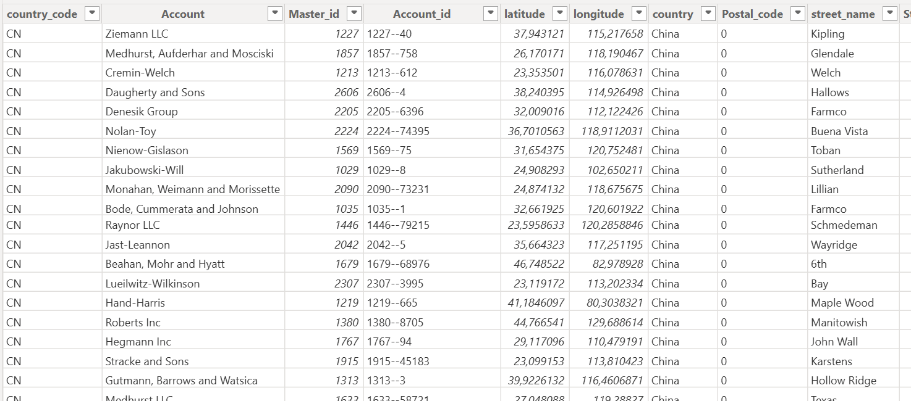

 - Dates

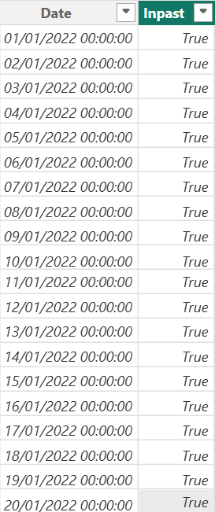

 - Table des produits

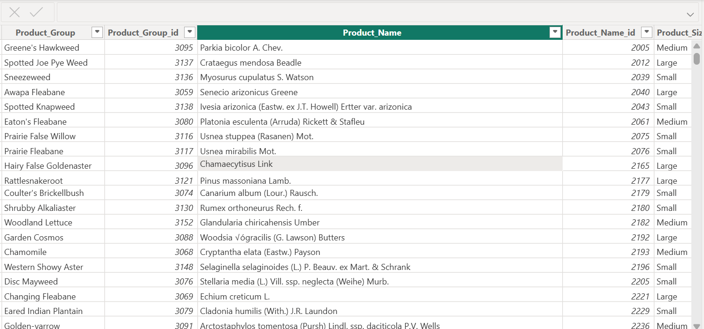

 - Table des ventes

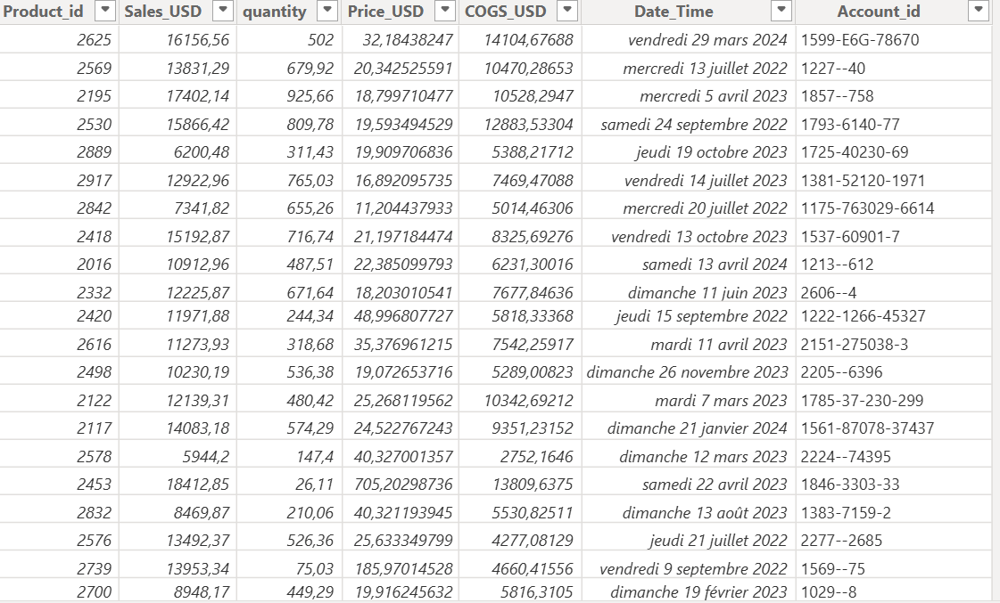

### 4. Model de données

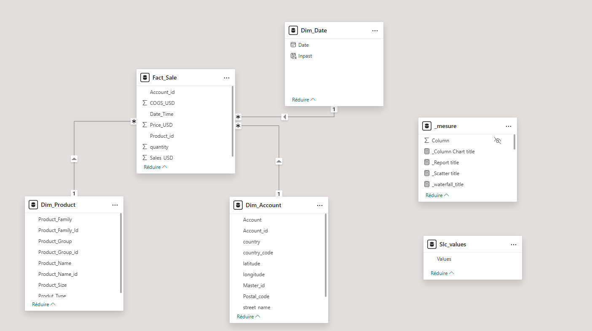

Nous avons un  modèle en étoile avec pour table de faits "Fact_Sale" et tables de dimensions "Dim_product", "Dim_Date", "Dim_Account"

"_mesure" et "Slc_values" servent juste pour les calculs et les filtres 

 ## II. Graphiques 

 ### 1. Montants des ventes 2023

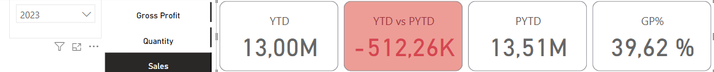

- YTD = montant cumulé des ventes de l'an 2023
- PYTD = montant cumulé des ventes de l'an 2022
- YTD vs PYTD = la variation du montant des ventes entre les années 2023 et 2022(baisse de 512,26K)
- GP% = marge bénéficiaire de l'année 2023

 ### 2. Quantité Vendue 2023

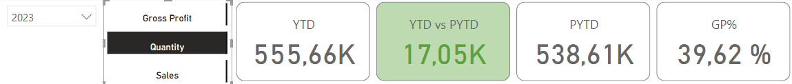

- YTD = quantité cumulé des ventes de l'an 2023
- PYTD = quantité cumulé des ventes de l'an 2022
- YTD vs PYTD = la variation des quantités vendues entre les années 2023 et 2022(hausse de 17,05K)
- GP% = marge bénéficiaire de l'année 2023

### 3. Profit Brut 2023

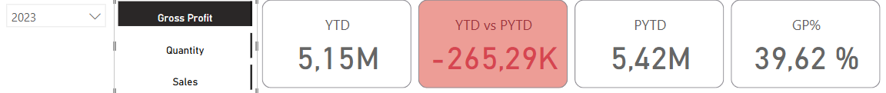

- YTD = profit brut de l'an 2023
- PYTD = profit brut de l'an 2022
- YTD vs PYTD = la variation des profit brut entre les années 2023 et 2022(hausse de 17,05K)
- GP% = marge bénéficiaire de l'année 2023

### 4.  10 des pays avec la plus faible crossance du  Profit Brut 2023


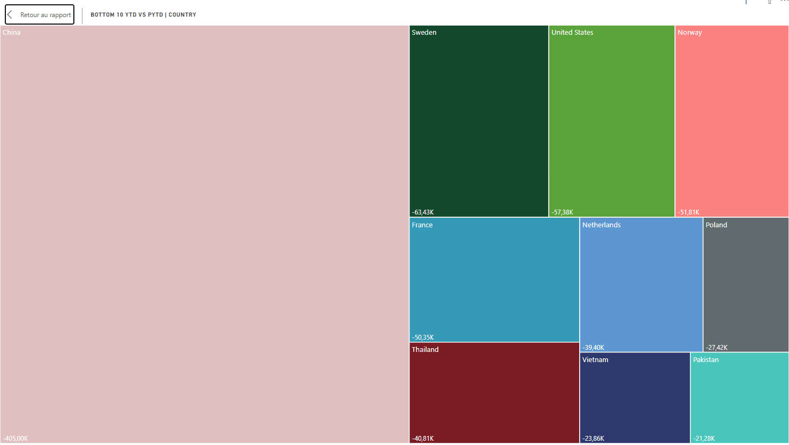

En 2023 la chine est le pays qui a le plus regréssé en terme de profit brut

### 5.  variation du profit brut entre les mois de l'année 2023 et 2022

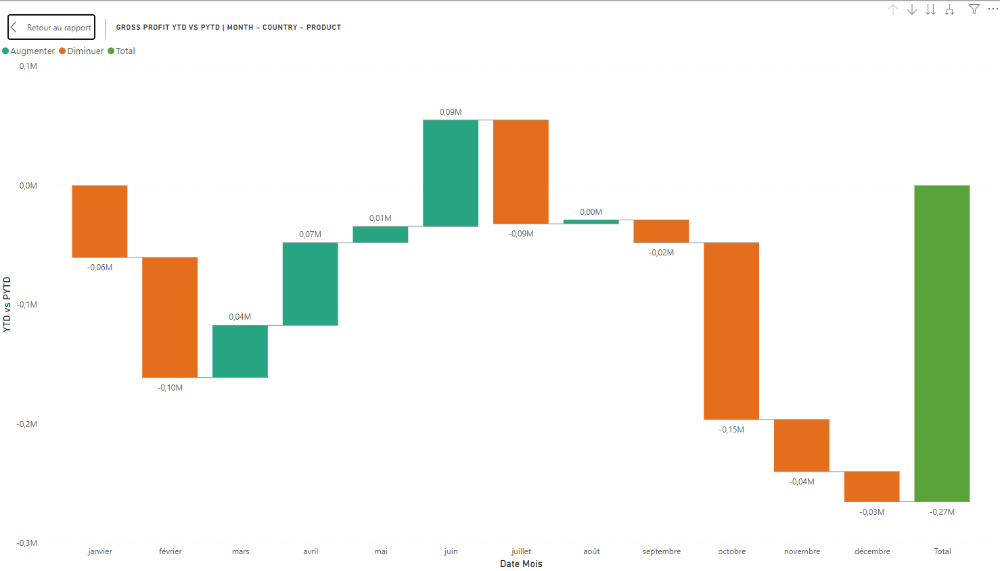

les mois d'octorbre et février 2023 sont les mois qui provoquent une grande chutte du profit brut par rapport à l'année 2022


### 6.  Evolution du profit brut au cours  des mois des années 2023 et 2022

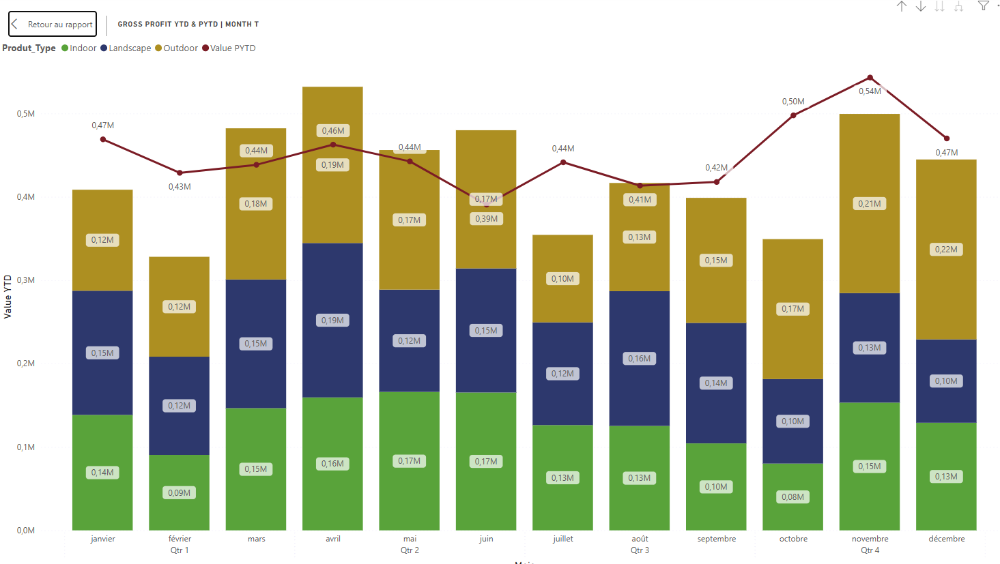

Nous avons la superpositions de 2 graphes:
- histogramme empilé qui montre l'évolution du profit aux cours de l'année 2023
- graphique en courbe qui montre l'évolution du profit aux cours de l'année 2022

### 7.  Segmentation des Comptes en Fonction du GP% et du Profit Brut

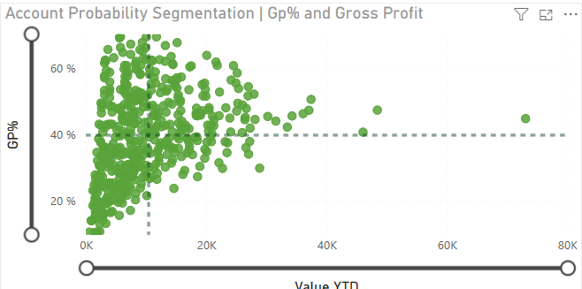

 Titre : Segmentation des Comptes en Fonction du GP% et du Profit Brut
Ce graphique de dispersion représente la répartition des comptes en fonction de leur marge brute (%) (GP%) sur l’axe vertical et de la valeur du profit brut 2023 sur l’axe horizontal.

- Chaque point vert représente un compte individuel.
- La majorité des points sont concentrés dans les faibles valeurs de profit brut et des GP% variables.
- Les lignes pointillées indiquent des seuils potentiels pour segmenter les comptes en différentes catégories.
- Ce type d’analyse permet d’identifier les comptes les plus rentables et ceux nécessitant une optimisation.

### NB

pour notre petite analyse nous avons fixé le filtre sur  l'année 2023 et sur l'indice de profit brut. Il est possible d évaluer les années 2021 et 2022 ainsi que les montants de ventes et les quantitées vendues 


 ## III. Apperçu du tableau de bord 

 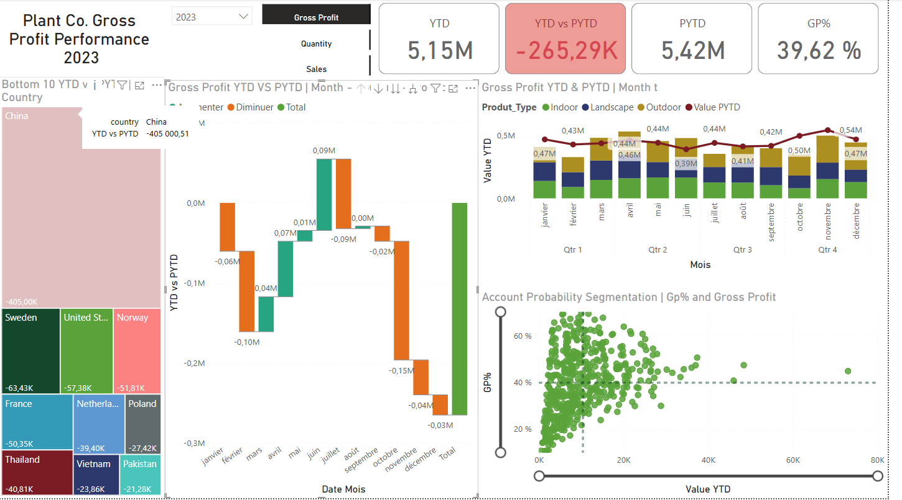


